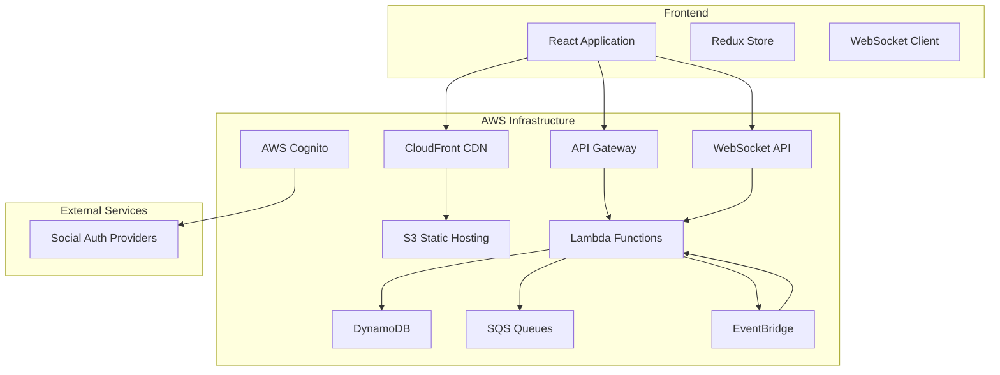

# Design Document

## Overview

The Steampunk Idle Game is a web-based multiplayer idle game featuring automated progression, social interactions, and Steampunk aesthetics. The system uses a React frontend with AWS serverless backend architecture to provide scalable, real-time gameplay experiences.

The game centers around three core activities (crafting, harvesting, combat) with idle progression mechanics, guild-based social features, and a player-driven economy through auctions. Players gradually specialize into tank, healer, or DPS roles through their skill choices rather than upfront class selection.

## Architecture

### High-Level Architecture



### Backend Architecture Patterns

**Microservices Pattern**: Each game feature (authentication, character progression, guilds, marketplace, chat) is implemented as separate Lambda functions with dedicated DynamoDB tables.

**Event-Driven Architecture**: Uses EventBridge for decoupled communication between services, enabling features like offline progress calculation and real-time updates.

**CQRS Pattern**: Separates read and write operations, with optimized read models for leaderboards and game state queries.

## Components and Interfaces

### Frontend Components

#### Core Game Interface
- **GameDashboard**: Main game view showing character stats, current activity, and progress
- **ActivitySelector**: Interface for switching between crafting, harvesting, and combat
- **InventoryManager**: Display and management of items, currency, and crafted goods
- **ProgressTracker**: Real-time display of idle progression and notifications

#### Social Features
- **ChatInterface**: Tabbed chat system (general, guild, whispers) with slash command support
- **GuildManager**: Guild creation, member management, and guild-specific features
- **PlayerProfile**: Character profile display with stats and specialization progress
- **Leaderboards**: Top 100 rankings across different stats with filtering

#### Group Content
- **ZoneExplorer**: Interface for creating and joining 1-3 player zones
- **DungeonFinder**: Interface for creating and joining 5-8 player dungeons
- **PartyManager**: Party composition, role selection, and coordination tools

#### Economy
- **AuctionHouse**: Marketplace for listing, browsing, and bidding on items
- **CraftingStation**: Interface for creating items with skill progression
- **ResourceTracker**: Display of harvested materials and crafting components

### Backend Services

#### Authentication Service
- **Endpoints**: `/auth/login`, `/auth/refresh`, `/auth/logout`
- **Integration**: AWS Cognito with social provider federation
- **Security**: JWT tokens with refresh mechanism

#### Character Service
- **Endpoints**: `/character/profile`, `/character/stats`, `/character/specialization`
- **Functions**: Character creation, stat tracking, specialization calculation
- **Data**: Character profiles, skill trees, specialization progress

#### Activity Service
- **Endpoints**: `/activity/switch`, `/activity/progress`, `/activity/rewards`
- **Functions**: Activity management, idle progression calculation, reward distribution
- **Background**: Scheduled Lambda for offline progress calculation

#### Guild Service
- **Endpoints**: `/guild/create`, `/guild/join`, `/guild/members`, `/guild/manage`
- **Functions**: Guild management, member permissions, guild-specific features
- **Integration**: Chat service for guild channels

#### Marketplace Service
- **Endpoints**: `/auction/list`, `/auction/bid`, `/auction/search`, `/auction/complete`
- **Functions**: Item listing, bidding system, transaction processing
- **Background**: Scheduled Lambda for auction expiration handling

#### Chat Service
- **WebSocket API**: Real-time message delivery
- **Functions**: Message routing, slash command processing, moderation
- **Storage**: Message history, private message queuing

#### Zone/Dungeon Service
- **Endpoints**: `/zone/create`, `/zone/join`, `/dungeon/create`, `/dungeon/join`
- **Functions**: Instance creation, party management, encounter generation
- **Real-time**: WebSocket integration for party coordination

#### Leaderboard Service
- **Endpoints**: `/leaderboard/stats`, `/leaderboard/rankings`
- **Functions**: Ranking calculation, stat aggregation
- **Background**: Scheduled updates for leaderboard refresh

## Data Models

### Core Entities

#### User
```typescript
interface User {
  userId: string;
  email: string;
  socialProviders: SocialProvider[];
  createdAt: Date;
  lastLogin: Date;
}
```

#### Character
```typescript
interface Character {
  userId: string;
  characterId: string;
  name: string;
  level: number;
  experience: number;
  stats: CharacterStats;
  specialization: Specialization;
  currentActivity: Activity;
  lastActiveAt: Date;
}

interface CharacterStats {
  strength: number;
  dexterity: number;
  intelligence: number;
  vitality: number;
  craftingSkills: SkillSet;
  harvestingSkills: SkillSet;
  combatSkills: SkillSet;
}

interface Specialization {
  tankProgress: number;
  healerProgress: number;
  dpsProgress: number;
  primaryRole?: 'tank' | 'healer' | 'dps';
}
```

#### Guild
```typescript
interface Guild {
  guildId: string;
  name: string;
  description: string;
  leaderId: string;
  members: GuildMember[];
  settings: GuildSettings;
  createdAt: Date;
}

interface GuildMember {
  userId: string;
  role: 'leader' | 'officer' | 'member';
  joinedAt: Date;
  permissions: string[];
}
```

#### Item
```typescript
interface Item {
  itemId: string;
  name: string;
  type: 'weapon' | 'armor' | 'trinket' | 'material' | 'consumable';
  rarity: 'common' | 'uncommon' | 'rare' | 'epic' | 'legendary';
  stats: ItemStats;
  craftingRequirements?: CraftingRecipe;
  steampunkTheme: ThemeData;
}
```

#### AuctionListing
```typescript
interface AuctionListing {
  listingId: string;
  sellerId: string;
  itemId: string;
  startingPrice: number;
  buyoutPrice?: number;
  currentBid?: number;
  currentBidderId?: string;
  expiresAt: Date;
  status: 'active' | 'sold' | 'expired';
}
```

### Database Design

#### DynamoDB Tables

**Users Table**
- Primary Key: `userId`
- GSI: `email-index` for email lookups
- Attributes: User profile and authentication data

**Characters Table**
- Primary Key: `userId`
- Attributes: Character stats, specialization, activity state
- TTL: For inactive character cleanup

**Guilds Table**
- Primary Key: `guildId`
- GSI: `leader-index` for guild management queries
- Attributes: Guild metadata and settings

**GuildMembers Table**
- Primary Key: `guildId`, Sort Key: `userId`
- GSI: `user-guild-index` for user's guild lookup
- Attributes: Member roles and permissions

**Items Table**
- Primary Key: `itemId`
- GSI: `type-rarity-index` for filtering
- Attributes: Item stats and crafting data

**Inventory Table**
- Primary Key: `userId`, Sort Key: `itemId`
- Attributes: Quantity, acquisition date
- GSI: `item-owners-index` for marketplace queries

**AuctionListings Table**
- Primary Key: `listingId`
- GSI: `status-expires-index` for active listings
- GSI: `seller-index` for seller's listings
- TTL: Automatic cleanup of expired listings

**ChatMessages Table**
- Primary Key: `channelId`, Sort Key: `timestamp`
- GSI: `recipient-index` for private messages
- TTL: Message retention policy
- Attributes: Message content and metadata

**Leaderboards Table**
- Primary Key: `statType`, Sort Key: `rank`
- Attributes: User ID, stat value, last updated
- Updated via scheduled Lambda

## Error Handling

### Frontend Error Handling

**Network Errors**: Retry logic with exponential backoff for API calls
**WebSocket Disconnections**: Automatic reconnection with state synchronization
**Authentication Errors**: Token refresh flow with fallback to re-authentication
**Validation Errors**: Client-side validation with server-side verification

### Backend Error Handling

**Lambda Function Errors**: Structured error responses with appropriate HTTP status codes
**DynamoDB Errors**: Retry logic for throttling, circuit breaker for persistent failures
**External Service Errors**: Graceful degradation for social authentication failures
**Concurrency Errors**: Optimistic locking for critical operations like auctions

### Monitoring and Alerting

**CloudWatch Metrics**: Custom metrics for game-specific events (logins, transactions, errors)
**X-Ray Tracing**: Distributed tracing for performance monitoring
**CloudWatch Alarms**: Alerts for error rates, latency thresholds, and system health
**Dead Letter Queues**: Failed message handling with manual intervention capabilities

## Testing Strategy

### Frontend Testing

**Unit Tests**: Jest and React Testing Library for component testing
**Integration Tests**: API integration testing with mock backends
**E2E Tests**: Cypress for critical user flows (authentication, core gameplay)
**Performance Tests**: Lighthouse CI for performance regression detection

### Backend Testing

**Unit Tests**: Jest for individual Lambda function testing
**Integration Tests**: LocalStack for AWS service integration testing
**Load Tests**: Artillery for API endpoint load testing
**Contract Tests**: Pact for API contract verification between services

### Game-Specific Testing

**Idle Progression Tests**: Automated tests for offline progress calculation accuracy
**Real-time Features**: WebSocket connection and message delivery testing
**Economy Tests**: Auction system integrity and transaction validation
**Specialization Tests**: Character progression and role calculation validation

### Testing Environments

**Development**: Local development with LocalStack and mock data
**Staging**: Full AWS environment with production-like data for integration testing
**Production**: Blue-green deployment with canary releases for safe updates

## Security Considerations

### Authentication and Authorization
- JWT tokens with short expiration and refresh mechanism
- Social provider integration through AWS Cognito
- Role-based access control for guild management features

### Data Protection
- Encryption at rest for all DynamoDB tables
- Encryption in transit for all API communications
- Input validation and sanitization for all user inputs

### Game Security
- Server-side validation for all game state changes
- Rate limiting for API endpoints and chat messages
- Anti-cheat measures for progression validation

### Infrastructure Security
- VPC configuration for Lambda functions requiring database access
- IAM roles with least privilege principle
- API Gateway throttling and request validation