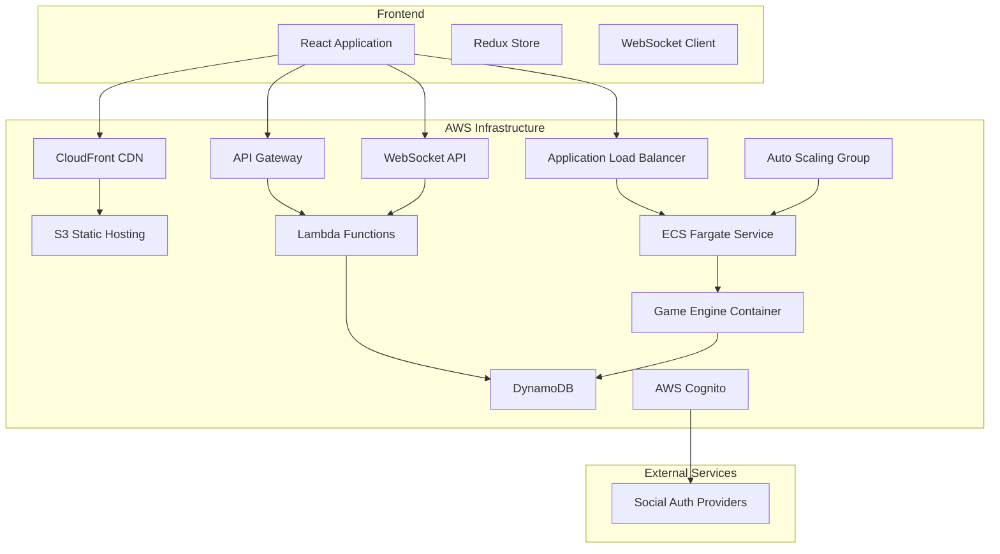

# Design Document

## Overview

The Steampunk Idle Game is a web-based multiplayer idle game featuring automated progression, social interactions, and Steampunk aesthetics. The system uses a React frontend with AWS serverless backend architecture to provide scalable, real-time gameplay experiences.

The game centers around three core activities (crafting, harvesting, combat) with idle progression mechanics, guild-based social features, and a player-driven economy through auctions. Players gradually specialize into Steampunk-themed roles (tank, healer, DPS) through their skill choices rather than upfront class selection.

**Key Design Principles:**
- **Mandatory Character Creation**: All authenticated users must create a unique character before accessing any game features
- **Organic Role Development**: Character specialization emerges naturally through gameplay choices and skill development
- **Predictable Resource Collection**: Harvesting yields consistent primary materials with rare exotic discoveries
- **Enhanced User Experience**: Responsive design with detailed character panels and intuitive resource management
- **Authentication-First Flow**: Users authenticate first, then are immediately directed to character creation if needed

## Architecture

### High-Level Architecture



### Backend Architecture Patterns

**Hybrid Serverless-Container Architecture**: Core game features (authentication, character progression, guilds, marketplace, chat) are implemented as Lambda functions, while the continuous game engine runs on ECS Fargate for persistent task processing.

**Continuous Processing Engine**: The Fargate-based game engine provides 24/7 task queue processing, handling idle progression, resource harvesting, and combat activities without the cold start limitations of Lambda.

**Event-Driven Architecture**: Uses EventBridge for decoupled communication between services, enabling features like offline progress calculation and real-time updates.

**CQRS Pattern**: Separates read and write operations, with optimized read models for leaderboards and game state queries.

**Auto-Scaling Container Service**: ECS Fargate automatically scales the game engine based on CPU and memory utilization, ensuring optimal performance during peak usage periods.

### Fargate Game Engine Architecture

**Continuous Task Processing**: The game engine runs as a containerized Node.js application on ECS Fargate, processing player task queues every second without interruption.

**In-Memory Queue Management**: Active task queues are cached in memory for high-performance processing, with periodic database synchronization for persistence.

**Auto-Scaling Configuration**:
- **Minimum Capacity**: 1 instance for baseline processing
- **Maximum Capacity**: 3 instances for peak load handling
- **CPU Scaling**: Scales up when CPU utilization exceeds 70%
- **Memory Scaling**: Scales up when memory utilization exceeds 80%

**Health Monitoring**: Application Load Balancer performs health checks on `/health` endpoint, with automatic container replacement for failed instances.

**Graceful Shutdown**: SIGTERM and SIGINT handlers ensure all task queues are saved to database before container termination.

**RESTful API Endpoints**:
- `GET /health` - Health check and system status
- `GET /task-queue/:playerId` - Get player's task queue status with real-time progress
- `POST /task-queue/sync` - Sync player's task queue from database
- `POST /task-queue/add-task` - Add new task to player's queue
- `POST /task-queue/stop-tasks` - Stop all tasks for a player

**Resource Management**: Each container allocated 1024 MiB memory and 512 CPU units, optimized for continuous processing workloads.

## Harvesting System Design

### Resource Collection Mechanics

The harvesting system implements a predictable resource collection model with rare discovery opportunities:

**Primary Material Guarantee**: Each harvesting action yields exactly one primary material based on the selected activity type (mining yields ore, logging yields wood, etc.).

**Exotic Item Discovery**: A base chance of less than 1% exists for each harvest to yield an exotic item in addition to the primary material. This chance increases slightly with harvesting skill level progression.

**Activity-Specific Pools**: Different harvesting activities have unique exotic item pools that align with their thematic context (mining might yield rare gems, logging might yield enchanted bark).

**Skill Progression Impact**: Higher harvesting skill levels provide:
- Slightly increased exotic discovery rates
- Access to higher-tier harvesting locations
- Improved efficiency in resource collection speed

### Harvesting Interface Design

**Immediate Access**: Clicking "Resource Harvesting" opens the interface immediately without additional navigation steps.

**Flexible Control Options**:
- Number input for harvest rounds (defaults to infinite for continuous harvesting)
- "Start Harvesting" button for immediate activity switching
- "Add to Queue" button for activity queuing without interruption

**Real-time Feedback**: Visual progress indicators, completion notifications, and reward displays provide immediate feedback on harvesting progress.

**Activity Queuing**: Players can queue multiple harvesting activities to execute sequentially, enabling strategic resource planning.

## Components and Interfaces

### Frontend Components

#### Core Game Interface
- **GameDashboard**: Main game view showing character stats, current activity, and progress
- **ActivitySelector**: Interface for switching between crafting, harvesting, and combat
- **InventoryManager**: Display and management of items, currency, and crafted goods
- **ProgressTracker**: Real-time display of idle progression and notifications
- **CharacterPanel**: Enhanced modal interface showing detailed character attributes, inventory with rarity colors, skills, and specialization progress
- **ResourceHarvesting**: Detailed resource management interface with flexible control options, activity queuing, and real-time progress feedback

#### Social Features
- **ChatInterface**: Tabbed chat system (general, guild, whispers) with slash command support
- **GuildManager**: Guild creation, member management, and guild-specific features
- **PlayerProfile**: Character profile display with stats and specialization progress
- **Leaderboards**: Top 100 rankings across different stats with filtering

#### Group Content
- **ZoneExplorer**: Interface for creating and joining 1-3 player zones
- **DungeonFinder**: Interface for creating and joining 5-8 player dungeons
- **PartyManager**: Party composition, role selection, and coordination tools

#### Economy
- **AuctionHouse**: Marketplace for listing, browsing, and bidding on items
- **CraftingStation**: Interface for creating items with skill progression
- **ResourceTracker**: Display of harvested materials and crafting components

### Backend Services

#### Authentication Service
- **Endpoints**: `/auth/login`, `/auth/refresh`, `/auth/logout`, `/auth/register`, `/auth/verify-email`, `/auth/reset-password`
- **Integration**: AWS Cognito with social provider federation (X, Facebook, Google)
- **Security**: JWT tokens with refresh mechanism, email verification for new registrations
- **Flow Control**: Automatic redirection to character creation for first-time users

#### Character Service
- **Endpoints**: `/character/create`, `/character/profile`, `/character/stats`, `/character/specialization`, `/character/validate-name`
- **Functions**: Mandatory character creation with unique name validation, stat tracking, specialization calculation
- **Data**: Character profiles, skill trees, specialization progress, character name uniqueness tracking
- **Validation**: Real-time character name uniqueness checking across all players

#### Activity Service
- **Endpoints**: `/activity/switch`, `/activity/progress`, `/activity/rewards`
- **Functions**: Activity management, idle progression calculation, reward distribution
- **Integration**: Communicates with Fargate Game Engine for real-time task processing
- **Background**: Fargate service provides continuous task queue processing instead of scheduled Lambda

#### Guild Service
- **Endpoints**: `/guild/create`, `/guild/join`, `/guild/members`, `/guild/manage`
- **Functions**: Guild management, member permissions, guild-specific features
- **Integration**: Chat service for guild channels

#### Marketplace Service
- **Endpoints**: `/auction/list`, `/auction/bid`, `/auction/search`, `/auction/complete`
- **Functions**: Item listing, bidding system, transaction processing
- **Background**: Scheduled Lambda for auction expiration handling

#### Chat Service
- **WebSocket API**: Real-time message delivery
- **Functions**: Message routing, slash command processing, moderation
- **Storage**: Message history, private message queuing

#### Zone/Dungeon Service
- **Endpoints**: `/zone/create`, `/zone/join`, `/dungeon/create`, `/dungeon/join`
- **Functions**: Instance creation, party management, encounter generation
- **Real-time**: WebSocket integration for party coordination

#### Leaderboard Service
- **Endpoints**: `/leaderboard/stats`, `/leaderboard/rankings`
- **Functions**: Ranking calculation, stat aggregation
- **Background**: Scheduled updates for leaderboard refresh

## Data Models

### Core Entities

#### User
```typescript
interface User {
  userId: string;
  email: string;
  socialProviders: SocialProvider[];
  createdAt: Date;
  lastLogin: Date;
}
```

#### Character
```typescript
interface Character {
  userId: string;
  characterId: string;
  name: string;
  level: number;
  experience: number;
  stats: CharacterStats;
  specialization: Specialization;
  currentActivity: Activity;
  lastActiveAt: Date;
}

interface CharacterStats {
  strength: number;
  dexterity: number;
  intelligence: number;
  vitality: number;
  craftingSkills: SkillSet;
  harvestingSkills: SkillSet;
  combatSkills: SkillSet;
}

interface Specialization {
  tankProgress: number;
  healerProgress: number;
  dpsProgress: number;
  primaryRole?: 'tank' | 'healer' | 'dps';
  steampunkThemes: {
    tank: string; // e.g., "Steam-Powered Guardian"
    healer: string; // e.g., "Clockwork Medic"
    dps: string; // e.g., "Gear-Strike Specialist"
  };
}
```

#### Guild
```typescript
interface Guild {
  guildId: string;
  name: string;
  description: string;
  leaderId: string;
  members: GuildMember[];
  settings: GuildSettings;
  createdAt: Date;
}

interface GuildMember {
  userId: string;
  role: 'leader' | 'officer' | 'member';
  joinedAt: Date;
  permissions: string[];
}
```

#### Item
```typescript
interface Item {
  itemId: string;
  name: string;
  type: 'weapon' | 'armor' | 'trinket' | 'material' | 'consumable';
  rarity: 'common' | 'uncommon' | 'rare' | 'epic' | 'legendary';
  stats: ItemStats;
  craftingRequirements?: CraftingRecipe;
  steampunkTheme: ThemeData;
}
```

#### AuctionListing
```typescript
interface AuctionListing {
  listingId: string;
  sellerId: string;
  itemId: string;
  startingPrice: number;
  buyoutPrice?: number;
  currentBid?: number;
  currentBidderId?: string;
  expiresAt: Date;
  status: 'active' | 'sold' | 'expired';
}
```

#### TaskQueue
```typescript
interface TaskQueue {
  playerId: string;
  currentTask: Task | null;
  queuedTasks: Task[];
  isRunning: boolean;
  totalTasksCompleted: number;
  totalTimeSpent: number;
  lastProcessed: string;
  lastSaved: number;
}

interface Task {
  id: string;
  name: string;
  type: 'HARVESTING' | 'COMBAT' | 'CRAFTING';
  duration: number;
  startTime: number;
  completed: boolean;
  rewards?: TaskReward[];
}

interface TaskReward {
  type: 'resource' | 'experience' | 'currency' | 'item';
  itemId?: string;
  quantity: number;
  rarity?: 'common' | 'uncommon' | 'rare' | 'epic' | 'legendary';
  isRare: boolean;
}
```

### Database Design

#### DynamoDB Tables

**Users Table**
- Primary Key: `userId`
- GSI: `email-index` for email lookups
- Attributes: User profile and authentication data

**Characters Table**
- Primary Key: `userId`
- Attributes: Character stats, specialization, activity state
- TTL: For inactive character cleanup

**Guilds Table**
- Primary Key: `guildId`
- GSI: `leader-index` for guild management queries
- Attributes: Guild metadata and settings

**GuildMembers Table**
- Primary Key: `guildId`, Sort Key: `userId`
- GSI: `user-guild-index` for user's guild lookup
- Attributes: Member roles and permissions

**Items Table**
- Primary Key: `itemId`
- GSI: `type-rarity-index` for filtering
- Attributes: Item stats and crafting data

**Inventory Table**
- Primary Key: `userId`, Sort Key: `itemId`
- Attributes: Quantity, acquisition date
- GSI: `item-owners-index` for marketplace queries

**AuctionListings Table**
- Primary Key: `listingId`
- GSI: `status-expires-index` for active listings
- GSI: `seller-index` for seller's listings
- TTL: Automatic cleanup of expired listings

**ChatMessages Table**
- Primary Key: `channelId`, Sort Key: `timestamp`
- GSI: `recipient-index` for private messages
- TTL: Message retention policy
- Attributes: Message content and metadata

**TaskQueues Table**
- Primary Key: `playerId`
- Attributes: Current task, queued tasks, processing state, completion stats
- Updated by Fargate Game Engine for continuous task processing
- GSI: `isRunning-index` for active queue queries

**Leaderboards Table**
- Primary Key: `statType`, Sort Key: `rank`
- Attributes: User ID, stat value, last updated
- Updated via scheduled Lambda

## Error Handling

### Authentication Flow Design

**First-Time User Flow**: 
1. User authenticates via email or social provider
2. System checks for existing character
3. If no character exists, redirect to mandatory character creation
4. Character creation requires unique name validation
5. Upon successful creation, redirect to main game interface

**Returning User Flow**:
1. User authenticates
2. System verifies existing character
3. Direct access to main game interface

**Character Creation Requirements**:
- Real-time name uniqueness validation
- Immediate character initialization with default stats
- Prevention of game access until character is created

### Frontend Error Handling

**Network Errors**: Retry logic with exponential backoff for API calls
**WebSocket Disconnections**: Automatic reconnection with state synchronization
**Authentication Errors**: Token refresh flow with fallback to re-authentication
**Validation Errors**: Client-side validation with server-side verification
**Character Creation Errors**: Name uniqueness validation with helpful error messages

### Backend Error Handling

**Lambda Function Errors**: Structured error responses with appropriate HTTP status codes
**DynamoDB Errors**: Retry logic for throttling, circuit breaker for persistent failures
**External Service Errors**: Graceful degradation for social authentication failures
**Concurrency Errors**: Optimistic locking for critical operations like auctions

### Monitoring and Alerting

**CloudWatch Metrics**: Custom metrics for game-specific events (logins, transactions, errors)
**X-Ray Tracing**: Distributed tracing for performance monitoring
**CloudWatch Alarms**: Alerts for error rates, latency thresholds, and system health
**Dead Letter Queues**: Failed message handling with manual intervention capabilities

## Testing Strategy

### Frontend Testing

**Unit Tests**: Jest and React Testing Library for component testing
**Integration Tests**: API integration testing with mock backends
**E2E Tests**: Cypress for critical user flows (authentication, core gameplay)
**Performance Tests**: Lighthouse CI for performance regression detection

### Backend Testing

**Unit Tests**: Jest for individual Lambda function testing
**Integration Tests**: LocalStack for AWS service integration testing
**Container Tests**: Docker-based testing for Fargate game engine functionality
**Load Tests**: Artillery for API endpoint load testing, including Fargate service endpoints
**Contract Tests**: Pact for API contract verification between services
**Fargate Health Tests**: Automated testing of container health checks and auto-scaling behavior

### Game-Specific Testing

**Idle Progression Tests**: Automated tests for offline progress calculation accuracy
**Real-time Features**: WebSocket connection and message delivery testing
**Economy Tests**: Auction system integrity and transaction validation
**Specialization Tests**: Character progression and role calculation validation
**Harvesting Tests**: Resource collection mechanics and exotic item drop rate validation
**Character Creation Tests**: Unique name validation and mandatory creation flow testing

### Testing Environments

**Development**: Local development with LocalStack and mock data
**Staging**: Full AWS environment with production-like data for integration testing
**Production**: Blue-green deployment with canary releases for safe updates

## Security Considerations

### Authentication and Authorization
- JWT tokens with short expiration and refresh mechanism
- Social provider integration through AWS Cognito
- Role-based access control for guild management features

### Data Protection
- Encryption at rest for all DynamoDB tables
- Encryption in transit for all API communications
- Input validation and sanitization for all user inputs

### Game Security
- Server-side validation for all game state changes
- Rate limiting for API endpoints and chat messages
- Anti-cheat measures for progression validation

### Infrastructure Security
- VPC configuration for Lambda functions requiring database access
- IAM roles with least privilege principle
- API Gateway throttling and request validation

## Responsive Design Strategy

### Multi-Device Support

**Desktop Experience**: Full-featured interface with detailed panels, multiple simultaneous views, and comprehensive navigation.

**Tablet Experience**: Optimized touch interactions with appropriately sized buttons and touch targets, maintaining core functionality while adapting layout for medium screens.

**Mobile Experience**: Streamlined interface prioritizing essential features, with collapsible menus and touch-friendly controls optimized for smaller screens.

**Performance Optimization**: Device-specific rendering optimizations to ensure smooth performance across different hardware capabilities.

### Interface Adaptations

**Character Panel**: Responsive modal that adapts to screen size while maintaining readability of character attributes, inventory, and specialization details.

**Resource Harvesting**: Touch-friendly controls for mobile devices with appropriately sized input fields and buttons for harvest management.

**Chat Interface**: Collapsible chat panels on smaller screens with swipe gestures for channel switching on mobile devices.

**Navigation**: Adaptive navigation that transforms from horizontal menu bars on desktop to hamburger menus or bottom navigation on mobile.