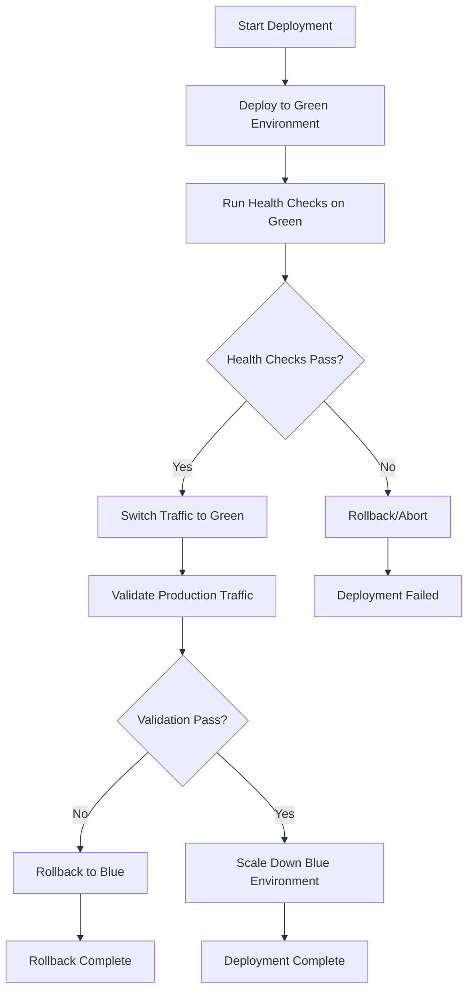

# Production Deployment Guide

This guide covers the production deployment procedures for the Task Queue System, including blue-green deployment strategy, monitoring setup, and rollback procedures.

## Overview

The production deployment system implements a blue-green deployment strategy to ensure zero-downtime updates and provides comprehensive monitoring and alerting capabilities.

### Key Features

- **Zero-downtime deployments** using blue-green strategy
- **Automated rollback procedures** for deployment issues
- **Comprehensive monitoring and alerting**
- **Infrastructure as Code** using AWS CDK
- **Automated health checks and validation**

## Prerequisites

Before deploying to production, ensure you have:

1. **AWS CLI** installed and configured
2. **AWS CDK CLI** installed (`npm install -g aws-cdk`)
3. **Node.js** (version 18 or later)
4. **PowerShell** (for Windows deployment scripts)
5. **Proper AWS credentials** with deployment permissions
6. **Docker** for container image building

### Required AWS Permissions

Your AWS credentials need the following permissions:
- CloudFormation full access
- ECS full access
- EC2 full access
- Application Load Balancer full access
- Route 53 (if using custom domain)
- CloudWatch full access
- SNS full access
- Lambda full access

## Configuration

### Environment Variables

Set the following environment variables before deployment:

```bash
# Required
export AWS_ACCOUNT_ID="123456789012"
export AWS_REGION="us-east-1"
export ENVIRONMENT="production"
export VERSION="1.0.0"

# Optional
export DOMAIN_NAME="yourdomain.com"
export HOSTED_ZONE_ID="Z1234567890ABC"
export CERTIFICATE_ARN="arn:aws:acm:us-east-1:123456789012:certificate/12345678-1234-1234-1234-123456789012"
export ALERT_EMAIL="alerts@yourdomain.com"
export SLACK_WEBHOOK_URL="https://hooks.slack.com/services/..."
```

### Deployment Configuration

Edit `infrastructure/deployment-config.ts` to customize:

- Resource sizing (CPU, memory, instance counts)
- Scaling parameters
- Monitoring settings
- Security configurations

## Deployment Process

### 1. Initial Setup

First-time setup requires bootstrapping CDK:

```powershell
# Bootstrap CDK (one-time setup)
cdk bootstrap aws://$AWS_ACCOUNT_ID/$AWS_REGION

# Install dependencies
npm install
```

### 2. Build and Push Container Image

```powershell
# Build the application
npm run build

# Build Docker image
docker build -t task-queue:$VERSION .

# Tag and push to ECR
aws ecr get-login-password --region $AWS_REGION | docker login --username AWS --password-stdin $AWS_ACCOUNT_ID.dkr.ecr.$AWS_REGION.amazonaws.com
docker tag task-queue:$VERSION $AWS_ACCOUNT_ID.dkr.ecr.$AWS_REGION.amazonaws.com/task-queue:$VERSION
docker push $AWS_ACCOUNT_ID.dkr.ecr.$AWS_REGION.amazonaws.com/task-queue:$VERSION
```

### 3. Deploy Infrastructure

```powershell
# Deploy using the automated script
.\scripts\deploy-production.ps1 -Environment production -Version $VERSION

# Or deploy manually using CDK
cdk deploy --app "npx ts-node infrastructure/production-deployment-app.ts" --all --require-approval never
```

### 4. Verify Deployment

The deployment script automatically runs health checks, but you can manually verify:

```powershell
# Check stack status
aws cloudformation describe-stacks --stack-name task-queue-blue-green-production

# Check service health
curl https://your-load-balancer-dns/health

# Check task queue specific health
curl https://your-load-balancer-dns/api/task-queue/health
```

## Blue-Green Deployment Process

### How It Works

1. **Blue Environment**: Currently active production environment
2. **Green Environment**: New version deployed for testing
3. **Traffic Switch**: Atomic switch from blue to green
4. **Validation**: Health checks and monitoring
5. **Cleanup**: Scale down old environment

### Deployment Flow



### Manual Traffic Switch

If needed, you can manually switch traffic between environments:

```powershell
# Switch to green environment
aws cloudformation update-stack --stack-name task-queue-blue-green-production --use-previous-template --parameters ParameterKey=ActiveEnvironment,ParameterValue=green

# Switch to blue environment
aws cloudformation update-stack --stack-name task-queue-blue-green-production --use-previous-template --parameters ParameterKey=ActiveEnvironment,ParameterValue=blue
```

## Monitoring and Alerting

### CloudWatch Dashboard

Access the production dashboard at:
```
https://console.aws.amazon.com/cloudwatch/home?region=us-east-1#dashboards:name=task-queue-production-production
```

### Key Metrics Monitored

- **Task Queue Metrics**:
  - Active tasks count
  - Queue depth
  - Processing rate
  - Error rate

- **System Metrics**:
  - CPU utilization
  - Memory utilization
  - Running task count
  - Network I/O

- **Application Metrics**:
  - Response times
  - Error rates
  - Throughput

### Alerts Configuration

Alerts are configured for:

- High error rate (>5%)
- High queue depth (>100 tasks)
- Low processing rate (<1 task/minute)
- High CPU utilization (>80%)
- High memory utilization (>85%)
- Service health check failures

### Alert Channels

- **Email**: Configured via `ALERT_EMAIL` environment variable
- **Slack**: Configured via `SLACK_WEBHOOK_URL` environment variable
- **SNS**: Topic ARN available in stack outputs

## Rollback Procedures

### Automated Rollback

Use the rollback script for automated rollback:

```powershell
# Rollback to specific version
.\scripts\rollback-production.ps1 -Environment production -TargetVersion "1.0.0" -Reason "Critical bug fix"

# Dry run rollback (test without executing)
.\scripts\rollback-production.ps1 -Environment production -TargetVersion "1.0.0" -DryRun

# Force rollback (skip version validation)
.\scripts\rollback-production.ps1 -Environment production -TargetVersion "1.0.0" -Force
```

### Manual Rollback

If automated rollback fails:

1. **Identify target version**:
   ```powershell
   aws ecr describe-images --repository-name task-queue --query 'imageDetails[*].imageTags'
   ```

2. **Switch traffic to blue environment**:
   ```powershell
   aws cloudformation update-stack --stack-name task-queue-blue-green-production --use-previous-template --parameters ParameterKey=ActiveEnvironment,ParameterValue=blue ParameterKey=Version,ParameterValue=TARGET_VERSION
   ```

3. **Verify rollback**:
   ```powershell
   curl https://your-load-balancer-dns/health
   ```

### Rollback Validation

After rollback, the system automatically validates:

- Health check endpoints
- CloudWatch metrics
- Functional test suite
- Performance benchmarks

## Troubleshooting

### Common Issues

#### Deployment Fails During Health Checks

**Symptoms**: Green environment fails health checks
**Solutions**:
1. Check application logs in CloudWatch
2. Verify container image is correct
3. Check security group configurations
4. Validate environment variables

#### Traffic Switch Fails

**Symptoms**: Load balancer doesn't route to new environment
**Solutions**:
1. Check target group health
2. Verify listener rules
3. Check DNS propagation (if using custom domain)

#### High Resource Utilization

**Symptoms**: CPU/Memory alerts after deployment
**Solutions**:
1. Scale up resources in deployment config
2. Check for memory leaks in application
3. Review auto-scaling policies

### Debugging Commands

```powershell
# Check ECS service status
aws ecs describe-services --cluster task-queue-production --services task-queue-blue task-queue-green

# Check target group health
aws elbv2 describe-target-health --target-group-arn TARGET_GROUP_ARN

# View application logs
aws logs tail /aws/ecs/task-queue-production --follow

# Check CloudWatch metrics
aws cloudwatch get-metric-statistics --namespace TaskQueue/Production --metric-name ErrorRate --start-time 2023-01-01T00:00:00Z --end-time 2023-01-01T01:00:00Z --period 300 --statistics Average
```

## Security Considerations

### Network Security

- VPC with private subnets for application
- Public subnets only for load balancer
- Security groups with minimal required access
- WAF enabled for production (configurable)

### Access Control

- IAM roles with least privilege principle
- Service-to-service authentication
- Encrypted communication (HTTPS/TLS)
- Secrets managed via AWS Secrets Manager

### Monitoring Security

- VPC Flow Logs enabled (configurable)
- GuardDuty enabled for threat detection (configurable)
- CloudTrail for API auditing
- Regular security scanning

## Maintenance

### Regular Tasks

1. **Weekly**: Review CloudWatch dashboards and alerts
2. **Monthly**: Update container base images
3. **Quarterly**: Review and update security configurations
4. **As needed**: Scale resources based on usage patterns

### Backup and Recovery

- Database backups (if applicable) with configurable retention
- Infrastructure as Code in version control
- Deployment artifacts stored in ECR
- Configuration backups before each deployment

### Cost Optimization

- Auto-scaling to match demand
- Scheduled scaling for predictable patterns
- Regular review of unused resources
- Cost alerts and budgets

## Support and Escalation

### Monitoring Contacts

- **Primary**: Development team via email alerts
- **Secondary**: Operations team via Slack
- **Escalation**: Management via phone (configure separately)

### Emergency Procedures

1. **Immediate**: Use automated rollback script
2. **If rollback fails**: Manual traffic switch to blue environment
3. **Critical issues**: Contact on-call engineer
4. **System down**: Activate incident response plan

### Documentation Updates

Keep this guide updated with:
- New deployment procedures
- Configuration changes
- Lessons learned from incidents
- Performance optimization findings

---

For additional support, contact the development team or refer to the troubleshooting section above.