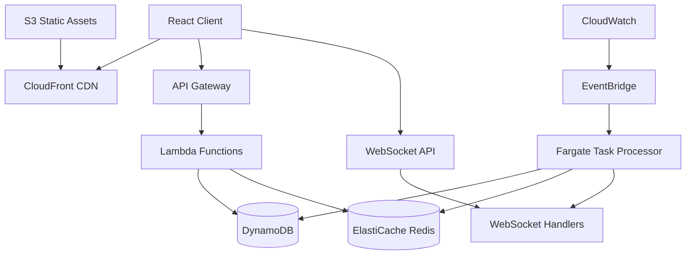
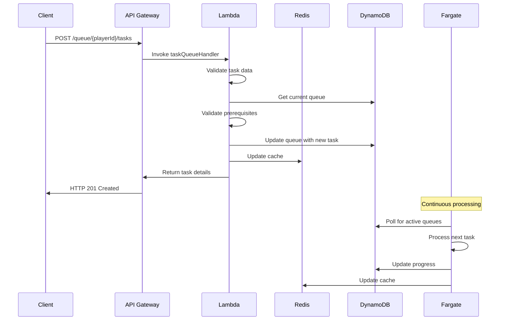
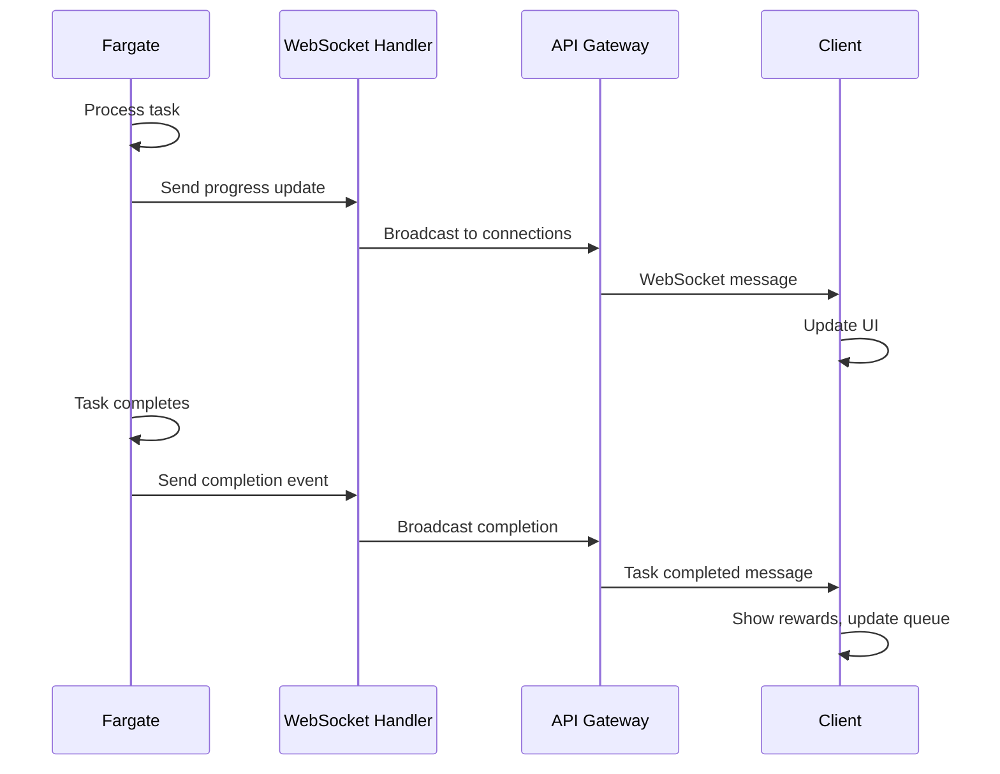
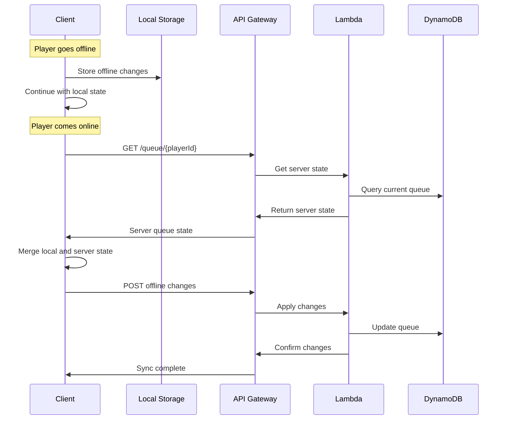
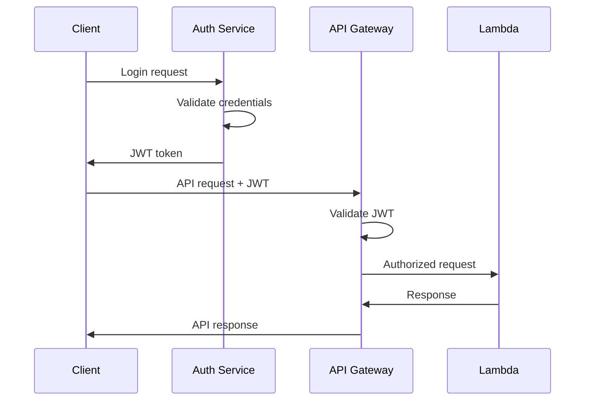

# System Architecture

## Overview

The Task Queue System is built on a serverless, event-driven architecture using AWS services. It provides scalable, reliable task processing with real-time updates and offline support.

## High-Level Architecture



## Core Components

### 1. Client Layer

**React Application**
- Responsive web interface
- Real-time queue updates via WebSocket
- Offline-first architecture with local state management
- Progressive Web App (PWA) capabilities

**Key Features:**
- Task queue visualization
- Drag-and-drop task reordering
- Real-time progress indicators
- Offline task queuing with sync

### 2. API Layer

**API Gateway**
- RESTful endpoints for queue operations
- Request/response transformation
- Rate limiting and throttling
- CORS configuration
- Request validation

**WebSocket API**
- Real-time bidirectional communication
- Connection management
- Message routing
- Authentication integration

**Endpoints:**
```
GET    /queue/{playerId}           - Get queue status
POST   /queue/{playerId}/tasks     - Add task
DELETE /queue/{playerId}/tasks/{id} - Remove task
POST   /queue/{playerId}/stop      - Stop all tasks
PUT    /queue/{playerId}/reorder   - Reorder tasks
```

### 3. Compute Layer

**Lambda Functions**
- Stateless request processing
- Auto-scaling based on demand
- Cold start optimization
- Error handling and retry logic

**Function Types:**
- `taskQueueHandler` - Main API operations
- `websocketHandler` - WebSocket connection management
- `authHandler` - Authentication and authorization
- `migrationHandler` - Database schema migrations

**Fargate Task Processor**
- Long-running task processing service
- Horizontal auto-scaling
- Health checks and monitoring
- Graceful shutdown handling

**Processing Features:**
- Continuous queue processing
- Task validation and execution
- Reward calculation
- Progress tracking
- Error recovery

### 4. Data Layer

**DynamoDB Tables**

*TaskQueues Table:*
```
PK: PLAYER#{playerId}
SK: QUEUE
Attributes:
- currentTask: Task | null
- queuedTasks: Task[]
- isRunning: boolean
- lastUpdated: number
- statistics: QueueStats

GSI1:
PK: ACTIVE_QUEUE | INACTIVE_QUEUE
SK: lastUpdated (timestamp)
```

*TaskHistory Table:*
```
PK: PLAYER#{playerId}
SK: TASK#{timestamp}#{taskId}
Attributes:
- taskId: string
- taskType: string
- completedAt: number
- duration: number
- rewards: TaskReward[]
- efficiency: number

TTL: 30 days
```

**ElastiCache Redis**
- Active queue state caching
- Session management
- Rate limiting counters
- Temporary data storage

**Cache Patterns:**
```
queue:{playerId}           - Queue state (TTL: 5min)
session:{sessionId}        - User session (TTL: 24h)
ratelimit:{playerId}       - Rate limit counters (TTL: 1min)
progress:{playerId}        - Task progress (TTL: 1h)
```

### 5. Event Processing

**EventBridge**
- Event routing and filtering
- Scheduled task processing
- Cross-service communication
- Event replay capabilities

**Event Types:**
- `task.started` - Task execution began
- `task.completed` - Task finished successfully
- `task.failed` - Task execution failed
- `queue.updated` - Queue structure changed
- `player.offline` - Player disconnected

### 6. Monitoring and Observability

**CloudWatch**
- Metrics collection and visualization
- Log aggregation and analysis
- Alerting and notifications
- Dashboard creation

**Key Metrics:**
- Active queue count
- Task processing rate
- Error rates by type
- Response times
- Resource utilization

## Data Flow

### 1. Task Addition Flow



### 2. Real-time Update Flow



### 3. Offline Synchronization Flow



## Scalability Patterns

### 1. Horizontal Scaling

**Auto Scaling Groups**
- Fargate services scale based on CPU/memory
- Lambda functions scale automatically
- DynamoDB auto-scaling for read/write capacity

**Load Distribution**
- API Gateway distributes requests
- Multiple Fargate instances process queues
- Redis cluster for cache distribution

### 2. Performance Optimization

**Caching Strategy**
```
L1: Client-side cache (React state)
L2: Redis cache (active data)
L3: DynamoDB (persistent storage)
```

**Database Optimization**
- Efficient partition key design
- Global Secondary Indexes for queries
- Batch operations for bulk updates
- Connection pooling

**Connection Management**
- WebSocket connection pooling
- Keep-alive for HTTP connections
- Circuit breaker pattern for failures

### 3. Fault Tolerance

**Error Handling**
- Exponential backoff for retries
- Dead letter queues for failed messages
- Circuit breaker for external services
- Graceful degradation

**Data Consistency**
- Atomic updates with DynamoDB transactions
- Eventual consistency with conflict resolution
- Backup and point-in-time recovery
- Cross-region replication

## Security Architecture

### 1. Authentication and Authorization

**JWT Token Flow**


**Authorization Levels**
- Player: Own queue operations only
- Admin: All queue operations + monitoring
- System: Internal service communication

### 2. Data Protection

**Encryption**
- TLS 1.3 for data in transit
- AES-256 for data at rest
- Field-level encryption for sensitive data
- Key rotation policies

**Access Control**
- IAM roles and policies
- VPC security groups
- Network ACLs
- Resource-based policies

### 3. Input Validation

**Validation Layers**
- Client-side validation (UX)
- API Gateway validation (schema)
- Lambda validation (business logic)
- Database constraints (data integrity)

## Deployment Architecture

### 1. Environment Separation

```
Development → Staging → Production
     ↓           ↓          ↓
   Dev AWS    Stage AWS   Prod AWS
   Account    Account     Account
```

**Environment Differences**
- Resource sizing
- Monitoring levels
- Backup retention
- Security policies

### 2. Infrastructure as Code

**CDK Stacks**
- `DatabaseStack` - DynamoDB tables and indexes
- `ComputeStack` - Lambda functions and Fargate
- `NetworkStack` - VPC, subnets, security groups
- `MonitoringStack` - CloudWatch, alarms, dashboards

**Deployment Pipeline**
```
Code → Build → Test → Deploy → Monitor
  ↓      ↓       ↓      ↓        ↓
GitHub  CDK    Jest   CDK     CloudWatch
```

### 3. Blue-Green Deployment

**Zero-Downtime Updates**
- Parallel environment deployment
- Traffic switching via Route 53
- Automated rollback on failure
- Database migration strategies

## Monitoring Architecture

### 1. Observability Stack

**Metrics (CloudWatch)**
- Business metrics (tasks processed, queue lengths)
- Technical metrics (response times, error rates)
- Infrastructure metrics (CPU, memory, disk)

**Logs (CloudWatch Logs)**
- Application logs with structured format
- Access logs from API Gateway
- Error logs with stack traces
- Audit logs for security events

**Traces (X-Ray)**
- Request tracing across services
- Performance bottleneck identification
- Error root cause analysis
- Service dependency mapping

### 2. Alerting Strategy

**Alert Levels**
- Critical: System down, data loss
- Warning: Performance degradation
- Info: Capacity thresholds reached

**Notification Channels**
- Email for critical alerts
- Slack for team notifications
- PagerDuty for on-call escalation
- Dashboard for visual monitoring

### 3. Health Checks

**Service Health**
- API Gateway health endpoints
- Lambda function health checks
- Fargate container health checks
- Database connectivity tests

**Business Health**
- Queue processing rates
- Task completion rates
- User engagement metrics
- Error rate thresholds

This architecture provides a robust, scalable foundation for the Task Queue System while maintaining flexibility for future enhancements and growth.